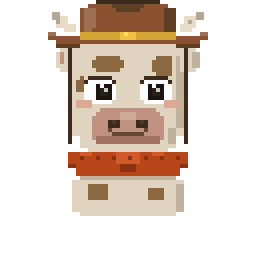

<p align="center">
  
</p>

<h1 align="center">SOL RANCH</h1>

<p align="center">
  <b>Burn tokens. Build your ranch. Earn USDC.</b><br/>
  <sub>A gamified DeFi farm on Solana with pixel art, real economics, and weekly payouts.</sub>
</p>

<p align="center">
  <a href="https://solranch.farm"></a>
  <a href="#"></a>
  <a href="#"></a>
  <a href="#license"></a>
</p>

<p align="center">
  
  
  
  
  
</p>

---

## What is Sol Ranch?

Sol Ranch is not another yield farm dashboard. It's a **full pixel art game** where your DeFi activity *is* the gameplay.

You burn `$RANCH` tokens to buy buildings, animals, crops, and decorations. You place them on a tile-based farm that you physically build out chunk by chunk. Everything you own generates daily points. Top ranchers earn real USDC every week.

No staking vaults. No liquidity pools. You burn tokens, you build a farm, you see it on screen, and you earn from it. The game *is* the protocol.

---

## How It Works

```
┌─────────────────────────────────────────────────────────┐
│                      PLAYER                             │
│            Connects Solana wallet                       │
└──────────────────────┬──────────────────────────────────┘
                       │
          ┌────────────▼────────────┐
          │       BURN $RANCH       │
          │  Send tokens to burn    │
          │  address, paste TX sig  │
          └────────────┬────────────┘
                       │
       ┌───────────────┼───────────────┐
       ▼               ▼               ▼
  ┌─────────┐   ┌───────────┐   ┌──────────┐
  │  SHOP   │   │   LAND    │   │  EXPAND  │
  │ Buy items│   │ Unlock    │   │  Build   │
  │ to your │   │ new chunks│   │  outward │
  │ inventory│   │ in rings  │   │  ring by │
  └────┬────┘   └─────┬─────┘   │  ring    │
       │              │          └──────────┘
       ▼              ▼
  ┌──────────────────────┐
  │     PLACE ON FARM    │
  │  Drag & drop items   │
  │  onto your land      │
  └──────────┬───────────┘
             │
  ┌──────────▼───────────┐
  │    EARN DAILY PTS    │
  │ Buildings: passive   │
  │ Animals: feed daily  │
  │ Crops: harvest       │
  │ Machines: boost      │
  └──────────┬───────────┘
             │
  ┌──────────▼───────────┐
  │  WEEKLY USDC PAYOUT  │
  │  Points → share of   │
  │  reward pool         │
  └──────────────────────┘
```

---

## Features

**Full Pixel Art Farm Game**
Not a dashboard with buttons. A real Phaser 3 game with animated animals that wander, crops that grow in stages, machines that animate, and a tile-based world you build from scratch.

**Burn-to-Earn Economy**
Every purchase burns `$RANCH` permanently. Buildings earn 1 pt/day per 50k burned. Animals earn daily if fed. Crops are consumable — plant, wait, harvest. Break-even in ~3 weeks incentivizes long-term play.

**Expandable Land System**
Start with 4 free chunks at the center. Expand outward in rings — 100k, 500k, 1M `$RANCH` per chunk. 64 total chunks on a 64x64 tile map. Your ranch layout is entirely yours.

**Multiplier Stacking**
Points multiply across three axes: rank (lifetime pts), hold tier (`$RANCH` balance), and streak (consecutive days). A Diamond-rank rancher with 30-day streak earns 9x base points.

**Weekly USDC Distribution**
Every week, the reward pool distributes USDC proportional to points earned. Hold `$RANCH` all week to qualify. Real yield from real activity.

**Mobile-First Design**
Built for phones. Pinch to zoom, drag to pan, touch to place. Bottom toolbar with SHOP / BAG / FEED / LAND. Works as an installable PWA. Android APK available.

---

## Game Economy

| Category | Cost Range | Daily Yield | Mechanic |
|:---------|:-----------|:------------|:---------|
| **Buildings** | 25k – 100k | 0.5 – 2 pts/day | Passive. Place and forget. |
| **Animals** | 2k – 15k | 0.2 – 1 pts/day | Must feed daily or earn nothing. |
| **Crops** | 1.5k – 5k | 20 – 100 pts/harvest | Consumable. ~3 harvests to break even. |
| **Machines** | 8k – 12k | Small + chunk boost | Boost production in their chunk. |
| **Decorations** | 500 – 2k | 0.1 pts/day | Tiny yield. Make your farm pretty. |

**Land Expansion**

| Ring | Chunks | Cost Each |
|:-----|:-------|:----------|
| Center | 4 | Free |
| Ring 1 | 12 | 100k $RANCH |
| Ring 2 | 20 | 500k $RANCH |
| Ring 3 | 28 | 1M $RANCH |

---

## Architecture

```
┌──────────────────────────┐     ┌──────────────────────┐
│     Frontend (React)     │     │     Solana Chain      │
│                          │     │                       │
│  Phaser 3 Game Engine    │     │  $RANCH Token (SPL)   │
│  ├─ Tile-based map       │     │  Burn Address         │
│  ├─ Sprite animations    │     │  TX Verification      │
│  ├─ Drag & drop placement│     └───────────┬───────────┘
│  └─ Touch/pinch controls │                 │
│                          │                 │
│  React UI Layer          │     ┌───────────▼───────────┐
│  ├─ Shop / Inventory     │     │   Helius API          │
│  ├─ Burn verification    │     │   Parse & verify      │
│  ├─ HUD & toolbar        │     │   burn transactions   │
│  └─ Toast notifications  │     └───────────┬───────────┘
└────────────┬─────────────┘                 │
             │ REST API                      │
┌────────────▼─────────────┐                 │
│   Backend (Express)      │◄────────────────┘
│                          │
│  /api/farm/*             │     ┌──────────────────────┐
│  ├─ buy (burn verify)    │     │   PostgreSQL         │
│  ├─ place / remove       │────▶│                      │
│  ├─ harvest / feed       │     │  ranchers, inventory │
│  ├─ unlock chunks        │     │  placements, points  │
│  └─ points calculation   │     │  burn_log, payouts   │
│                          │     └──────────────────────┘
│  /api/ranchers/*         │
│  /api/points/*           │     ┌──────────────────────┐
│  /api/rewards/*          │     │   Cron Jobs          │
│  /api/leaderboard        │     │                      │
└──────────────────────────┘     │  00:00 UTC snapshots │
                                 │  Weekly USDC distrib │
                                 │  Streak tracking     │
                                 └──────────────────────┘
```

---

## Project Structure

```
sol-ranch/
├── frontend/
│   ├── src/
│   │   ├── FarmView.jsx          # Game client — Phaser scene + React UI
│   │   ├── App.jsx               # Router (live dashboard)
│   │   └── main.jsx              # Entry point
│   ├── public/sprites/           # All game sprite assets
│   │   ├── game/                 # Extracted single sprites (buildings, animals, crops, deco, machines)
│   │   └── cozy/                 # Source spritesheets (shubibubi Cozy Farm pack)
│   └── vite.config.js
├── backend/
│   ├── src/
│   │   ├── index.js              # Express server
│   │   ├── routes/farm.js        # Farm game API
│   │   ├── routes/               # All other route modules
│   │   ├── db/                   # PostgreSQL connection + schema
│   │   ├── services/             # Points calc, tiers, rewards
│   │   └── scripts/              # Snapshot & distribution scripts
│   └── .env.example
├── schema.sql                    # Core DB schema
├── schema-farm.sql               # Farm game tables
└── docs/
    └── logo.png
```

---

## Development

```bash
# Clone
git clone https://github.com/S4PAY/solranch.git
cd solranch

# Backend
cd backend
cp .env.example .env              # Fill in DB credentials + Helius key
npm install
node src/index.js                 # Runs on port 3002

# Frontend
cd ../frontend
npm install
npm run dev                       # Runs on port 5173
```

**Production Deploy**
```bash
cd frontend && npm run build
cp -r public/sprites/ dist/sprites/   # Vite wipes dist — always copy sprites back
pm2 restart sol-ranch-dev
```

---

## Roadmap

- [x] Fullscreen Phaser farm game
- [x] Wallet login + auto-login
- [x] Shop with real items from DB
- [x] Burn-to-buy flow with TX verification
- [x] Drag & drop placement
- [x] Save/load farm state from DB
- [x] Move/remove placed items
- [x] Crop growth stages + harvest
- [x] Animal feeding system
- [x] Land expansion (ring-based burns)
- [ ] Daily passive points cron job
- [ ] Crop growth timers synced to server
- [ ] Machine chunk boost calculation
- [ ] Raid system (PvP point stealing)
- [ ] Trading post (player-to-player item trading)
- [ ] Seasonal events & limited items
- [ ] Mobile APK on Google Play

---

## Links

| | |
|:--|:--|
| **Website** | [solranch.farm](https://solranch.farm) |
| **Token** | [$RANCH on Pump.fun](https://pump.fun) |
| **Twitter** | [@Solranchfarm](https://twitter.com/Solranchfarm) |

---

## License

Proprietary. All rights reserved. This code is published for transparency, not for reuse. See [LICENSE](LICENSE) for details.

